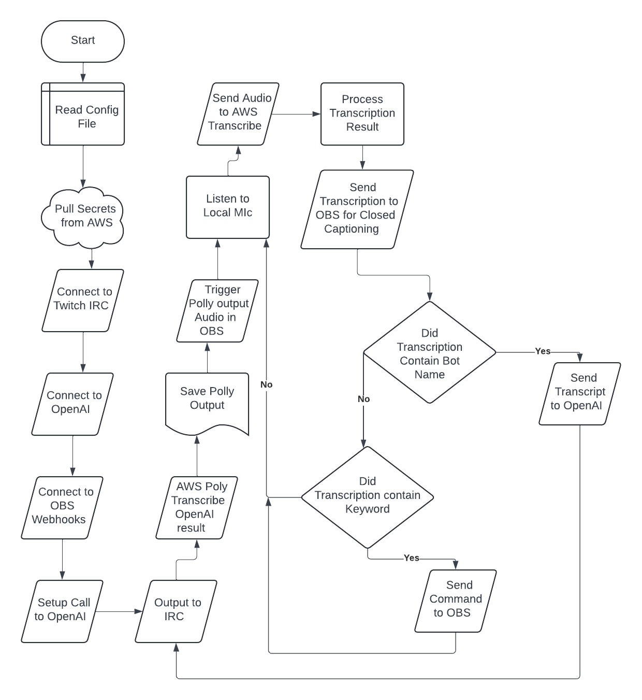

 # Raphael Twitch bot

### Setting Up Raphael Bot
### Copy raphaels files to a folder of your choosing.
- On windows systems you can run win-setup.bat to setup venv and add the required packages. This is assuming that winget is available from the command line for automated dependency installation. Tested on windows 11.
- On Mac os you can run the bash script mac-setup.sh
- On Ubuntu you can use ubuntu-setup.sh
### The following stand alone programs are dependencies
- Python3
- ffmpeg
- amazon.awscli
### The following packages will be installed to the venv environment:
- boto3
- irc
- openai
- opbsws_python
- sounddevice
- pyyaml
- aiofile
- amazon_transcribe

### Web Service Integrations
- OpenAI
- AWS
- OBS Studio Webhooks

### Web Service Flow

## AWS Setup
### It is ideal to create an IAM user for Raphael bot to use with the permissions listed below. No Console access should be given to this user.
### AWS CLI User permissions required:
- AmazonPollyReadOnlyAccess
- AmazonTranscribeFullAccess
- SecretsManagerReadWrite
#### Access to secrets manager can be restricted to the raphael-bot arn.

## No passwords should ever be stored in code or config files with this project.
### AWS Secret Manager - secret setup.
The following key / values pairs will need to be manually created in a secret called "raphael-bot".
- TwitchNickName
- TwitchPassword (oauth, not user)
- OpenAIUserName
- OpenAIOrganizationID
- OpenAIKey
- OpenAIProjectID
- ObsStudioServerKey

# Local Raphael Configuration
## config.yml should have all user configurable settings for raphael.

### Change these settings to your Twitch user name:
- twitch_irc_channel (Where Raphael should respond to questions)
- twitch_channel_url (Left over from when we were trying to pull audio from twitch rather than lcoal)
- obs_scene_keywords "Scene Name": "What to listen for"

# Running Raphael
- From Windows, in your Raphael folder run win-run.bat
- From Mac OS, in your Raphael folder run mac-run.sh
- From Ubuntu, in your Raphael folder run nix-run.sh

# Running individual functions of raphael bot.
python3 raph.py --help
- -h, --help show available parameters
- --config (file)  Use this option to pass in a different configuration file. Using your own config file will allow you to do a git pull and get any updates to raphael without loosing any customizations to the configuration file.
- --aiquery (query text) Send a prompt to ChatGPT
- --polly (what to say) (file name)  Send text to aws polly and get back an mp3 specified
- --listen the default action when you launch raphael.
- --pro_trans Pass the input to the process transcription function to test voice command processing. ex. --pro_trans "Scene everything."
- --twitch Send the input to twitch chat. Useful for testing the integration.
- --obs_scenes Get a list of the scenes in obs
- --obs_play (file) Make OBS play the audio file you specified.
- --obs_cc (text to put on screen) Make OBS add text to the screen.

